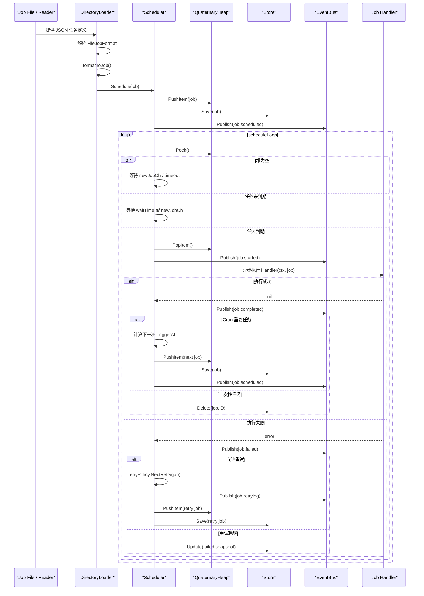
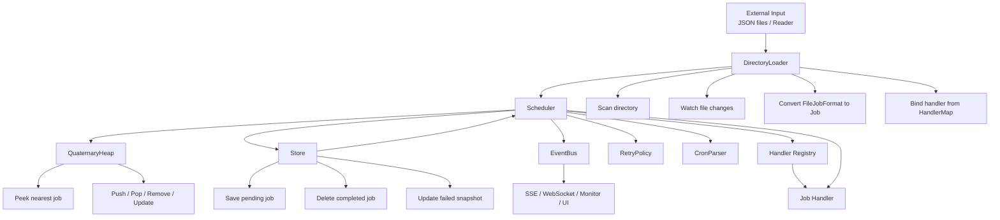

# Core 延迟任务系统分析

`godelayq/core/` 这一组代码把一个延迟任务系统拆成了四层：`Job` 数据模型、四叉堆 `QuaternaryHeap`、调度循环 `Scheduler`、事件总线 `EventBus`，以及外部数据接入器 `DirectoryLoader`。它们合起来形成了一个“任务进入 -> 排队 -> 到期执行 -> 事件广播 -> 持久化/恢复”的闭环。

## 1. 四叉堆负责“谁先执行”

`heap.go` 里的 `QuaternaryHeap` 是整个系统的时间索引结构。它按 `TriggerAt` 升序维护任务，堆顶永远是最近要执行的任务。

四叉堆比二叉堆更适合这里，因为每层分支更多，调整树高更低，插入/删除/下沉/上浮的实际路径更短。代码里还维护了 `indexMap`，可以通过 `job.ID` 直接定位堆内位置，从而支持：

- `Remove(id)`：按 ID 删除任务
- `Update(item)`：按 ID 更新并重排
- `Peek()`：快速查看最近任务

这让调度器不需要全量扫描，就能知道下一个该谁执行。

## 2. 调度循环负责“什么时候执行”

`scheduler.go` 的 `Scheduler.scheduleLoop()` 是系统的心脏。它不停看堆顶：

- 如果堆空，就等 `newJobCh` 或超时唤醒
- 如果堆顶任务已经到期，就 `PopItem()` 并执行
- 如果还没到期，就 `time.NewTimer(waitTime)` 精确等待

这个设计把“定时器”从任务级别抽象成了“堆顶级别”。也就是说，系统只需要盯住最早的任务，而不是给每个任务单独开定时器。

## 3. 事件总线负责“发生了什么”

`event.go` 的 `EventBus` 负责把调度过程中的状态变化广播出去。调度器在关键节点发布事件：

- `job.scheduled`
- `job.started`
- `job.completed`
- `job.failed`
- `job.cancelled`
- `job.retrying`

这带来两个好处：

- 监控和 UI 可以订阅事件，而不侵入调度主流程
- WebSocket/SSE/日志/告警都能复用同一事件源

换句话说，调度逻辑只管干活，事件总线负责“讲故事”。

## 4. 加载器负责“任务从哪来”

`load.go` 的 `DirectoryLoader` 把文件系统里的 JSON 任务接入系统。它做了三件事：

- 扫描目录并筛选任务文件
- 把 `FileJobFormat` 转成 `Job`
- 交给 `Scheduler.Schedule()` 入堆

它和调度器的关系很直接：加载器不自己执行任务，只负责把外部定义好的任务“喂”给调度器。这样就支持：

- 启动时批量恢复任务
- 运行中监控目录自动加载新任务
- 失败文件单独转移到错误目录

## 5. 端到端链路

系统整体链路可以概括成：

1. `DirectoryLoader` 从 JSON 文件或目录中读入任务
2. `Scheduler.Schedule()` 给任务补齐 ID、状态、触发时间并放进 `QuaternaryHeap`
3. `scheduleLoop()` 只关注堆顶任务，到期后弹出执行
4. 执行前后通过 `EventBus` 发布状态事件
5. 成功任务从存储中删除，失败任务按重试策略重新入堆
6. `Cancel()` 通过 `indexMap` 精确删除任务并广播取消事件

## 5.1 时序图

下面这张图展示了一个任务从文件加载进入系统，到被调度、执行、广播事件，再到成功清理或失败重试的完整路径。

## 5.2 模块关系图

下面这张图更适合从架构角度看整个系统。它强调的是“谁依赖谁”和“数据/控制流如何穿过各模块”。

## 6. 这个设计的关键点

它不是“简单的定时器队列”，而是一个带持久化、恢复、事件广播和重试能力的调度系统。四叉堆解决顺序问题，调度循环解决时间问题，事件总线解决可观测性问题，加载器解决任务来源问题。

## 7. 未完善的边界

当前实现已经能跑通完整闭环，但还有几个明显边界：

- `DirectoryLoader.BulkLoadFromReader()` 还比较简化
- `Scheduler` 里对重复任务、失败重试、持久化更新的细节还可以进一步收口

不过从架构上看，这套组合已经把延迟任务系统的核心骨架搭好了。
