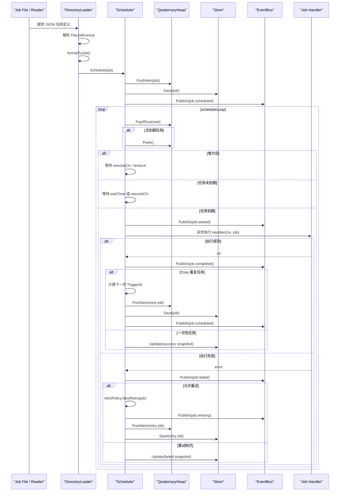
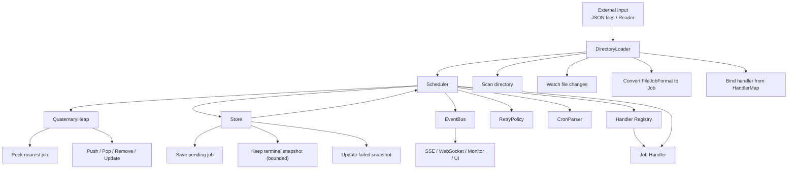

# Core 延迟任务系统分析

`godelayq/core/` 这一组代码把一个延迟任务系统拆成了四层：`Job` 数据模型、四叉堆 `QuaternaryHeap`、调度循环 `Scheduler`、事件总线 `EventBus`，以及外部数据接入器 `DirectoryLoader`。它们合起来形成了一个“任务进入 -> 排队 -> 到期执行 -> 事件广播 -> 持久化/恢复”的闭环。

## 1. 四叉堆负责“谁先执行”

`heap.go` 里的 `QuaternaryHeap` 是整个系统的时间索引结构。它按 `TriggerAt` 升序维护任务，堆顶永远是最近要执行的任务。

四叉堆比二叉堆更适合这里，因为每层分支更多，调整树高更低，插入/删除/下沉/上浮的实际路径更短。代码里还维护了 `indexMap`，可以通过 `job.ID` 直接定位堆内位置，从而支持：

- `Remove(id)`：按 ID 删除任务
- `Get(id)`：按 ID 取出任务（不弹出）
- `Update(item)`：按 ID 更新并重排
- `Peek()`：快速查看最近任务
- `PopIfDue(now)`：仅当堆顶已到期时原子弹出，避免"先看再取"之间任务被取消

这让调度器不需要全量扫描，就能知道下一个该谁执行。

## 2. 调度循环负责“什么时候执行”

`scheduler.go` 的 `Scheduler.scheduleLoop()` 是系统的心脏。它不停看堆顶：

- 如果堆空，就等 `newJobCh` 或超时唤醒
- 如果堆顶任务已经到期，`PopIfDue(now)` 原子弹出并投递给执行队列
- 如果还没到期，就 `time.NewTimer(waitTime)` 精确等待

这个设计把“定时器”从任务级别抽象成了“堆顶级别”。也就是说，系统只需要盯住最早的任务，而不是给每个任务单独开定时器。
`PopIfDue` 而不是 `Peek()` + `PopItem()`，是为了消除“看一眼再取走”之间任务被 `Cancel()` 摘掉的竞态。

投递方向是一条有界队列 `workCh` 加上固定数量的 worker 协程：

- 默认 `core.DefaultConcurrency = 100` 个 worker，队列容量与之相同；启动前用 `SetConcurrency(n)` 调整
- 队列满时 `scheduleLoop()` 阻塞在投递上，形成背压——到期风暴不会无限起协程，未投递的任务仍留在堆里，且已落盘可被下次 `Restore()` 找回
- 因此**Handler 必须自行做超时或尽快返回**：worker 被一个慢任务占住，就等于少一个并发额度
- `Stop()` 关闭 `stopCh` 后，会取消所有在途任务的上下文，避免不检查上下文的 Handler 把关停挂死

## 3. 事件总线负责“发生了什么”

`event.go` 的 `EventBus` 负责把调度过程中的状态变化广播出去。调度器在关键节点发布事件：

- `job.scheduled`
- `job.started`
- `job.completed`
- `job.failed`
- `job.cancelled`
- `job.retrying`

这带来两个好处：

- 监控和 UI 可以订阅事件，而不侵入调度主流程
- WebSocket/SSE/日志/告警都能复用同一事件源

换句话说，调度逻辑只管干活，事件总线负责“讲故事”。

## 4. 加载器负责“任务从哪来”

`load.go` 的 `DirectoryLoader` 把文件系统里的 JSON 任务接入系统。它做了三件事：

- 扫描目录并筛选任务文件
- 把 `FileJobFormat` 转成 `Job`
- 交给 `Scheduler.Schedule()` 入堆

它和调度器的关系很直接：加载器不自己执行任务，只负责把外部定义好的任务“喂”给调度器。这样就支持：

- 启动时批量恢复任务
- 运行中监控目录自动加载新任务
- 失败文件单独转移到错误目录

## 5. 端到端链路

系统整体链路可以概括成：

1. `DirectoryLoader` 从 JSON 文件或目录中读入任务
2. `Scheduler.Schedule()` 给任务补齐 ID、状态、触发时间并放进 `QuaternaryHeap`
3. `scheduleLoop()` 只关注堆顶任务，到期后弹出执行
4. 执行前后通过 `EventBus` 发布状态事件
5. 成功与最终失败的任务都留下终态快照（受存储的留痕策略约束），中间失败按重试策略重新入堆
6. `Cancel()` 通过 `indexMap` 精确删除任务并广播取消事件

## 5.1 时序图

下面这张图展示了一个任务从文件加载进入系统，到被调度、执行、广播事件，再到成功清理或失败重试的完整路径。

## 5.2 模块关系图

下面这张图更适合从架构角度看整个系统。它强调的是“谁依赖谁”和“数据/控制流如何穿过各模块”。

## 6. 持久化写入与执行超时

`store.go` 的 `JSONFileStore` 是"内存 map + 定期合并落盘"：`Save/Update/Delete` 只标脏，
后台协程每 `DefaultFlushInterval`（200ms）写一次文件，临时文件 + rename 保证原子性。
因此：

- 到期风暴或批量导入时，几百次变更合并成个位数次写入
- 崩溃时最多丢失一个周期的状态；需要立即落盘的调用方可以显式 `Flush()`
- 进程退出路径必须 `Close()`（`cmd/server` 用 defer 保证），它会停掉后台协程并做最后一次写盘

`LoadAll()` 返回存储里的**全部**快照，含终态留痕——状态过滤由调用方负责：
`Restore()` 自己跳过终态并把上次崩溃时的 `running` 复位为 `pending`，
`GET /jobs` 与 `GET /stats` 则按状态名过滤。任务进入 Handler 前会写一次 `running` 快照，
执行结束写终态，所以"当时在跑什么"在崩溃后依然可查。

终态留痕有界，避免 JSON 文件无界增长：`history_limit`（默认 1000 条，`-1` 关闭留痕）
与 `history_ttl` 只在写入终态时触发淘汰，`pending`/`running` 永不回收。

恢复侧由 `Scheduler.Restore()` 负责：只捞 `pending/running` 的快照，过期任务入堆后立即补跑，
Handler 在执行前按 `HandlerKey`（`Type`，回退 `Name`）绑定。

执行侧还有两个容易忽略的语义：

- `Job.Timeout` 会给 Handler 的 ctx 套一层 `WithTimeout`；不检查 ctx 的处理器依然会占住 worker 名额
- 父 ctx 被取消（用户 `Cancel` 或关停）不算任务失败：不记失败事件、不消耗重试次数，
  任务保持 `pending` 落盘等下次恢复——这是"至少一次"语义，Handler 需自行保证幂等

## 7. 这个设计的关键点

它不是“简单的定时器队列”，而是一个带持久化、恢复、事件广播和重试能力的调度系统。四叉堆解决顺序问题，调度循环解决时间问题，事件总线解决可观测性问题，加载器解决任务来源问题。

## 8. 未完善的边界

当前实现已经能跑通完整闭环，但还有几个明显边界：

- `DirectoryLoader.BulkLoadFromReader()` 还比较简化
- `Scheduler` 里对重复任务、失败重试、持久化更新的细节还可以进一步收口

不过从架构上看，这套组合已经把延迟任务系统的核心骨架搭好了。
